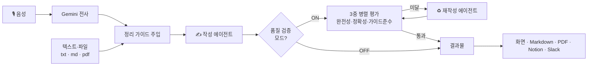

# 📚 강의 자동 정리기 (Lecture Auto-Summarizer)

> 강의 **녹음·슬라이드·텍스트**를 넣으면 **음성은 자동 전사 → LLM이 내 정리 가이드대로 요약 → 다중 에이전트 품질 검증 → 자동 재작성**하고,
> 결과를 **Markdown · PDF · Notion · Slack**으로 내보내는 웹 애플리케이션.

**핵심:** 단순 "요약 한 방"이 아니라, **작성 → 평가 → 재작성 루프(Agentic Orchestration)** 로
*강의 녹음 내용 누락 · 환각 · 가이드 위반* 을 스스로 잡아내는 도구.

---

## ✨ 주요 특징

- 📥 **다양한 입력** — 클로바노트 텍스트 · `.txt` · `.md` · 슬라이드 `.pdf` · **🎙️ 음성(mp3·wav·m4a)** (여러 개 동시)
- 🎙️ **음성 자동 전사** — 녹음 파일을 Gemini로 받아쓰기 → 클로바노트 없이 바로 정리 (멀티모달)
- 📝 **가이드 기반 요약** — 내 정리 스타일(가이드)을 그대로 주입해 일관된 결과 (앱에서 수정 가능)
- 🔁 **다중 에이전트 품질 검증** — 작성 후 **평가자 3종 병렬 실행** → 미달 시 **자동 재작성**(최대 2회)
- 📄 **다중 출력** — 화면 · Markdown · **PDF**(수식 렌더링) · **Notion 페이지 자동 생성** · **💬 Slack 완료 알림**
- ☁️ **다양한 배포** — 로컬 · Streamlit Cloud · Hugging Face · VPS(Docker)

---

## 🧩 동작 구조



품질 검증 모드의 **평가자 3종 (LLM-as-Judge):**

| 평가자 | 검사 항목 |
|---|---|
| **완전성** | 강의 **녹음 텍스트의 내용을 빠짐없이** 담았는가 |
| **정확성** | 원문에 없는 내용을 지어내지(환각) 않았는가 |
| **가이드 준수** | 정리 가이드의 형식·규칙을 따랐는가 |

→ **Orchestration / Evaluation(LLM-as-Judge) / Reflection** 패턴을 실제로 구현.

---

## 🛠 기술 스택

| 영역 | 사용 |
|---|---|
| App | **Streamlit** |
| LLM | **Google Gemini** (`google-genai`, 기본 `gemini-2.5-flash`) |
| 음성 전사 | **Gemini Files API** (오디오 → 텍스트, 멀티모달) |
| PDF | Markdown → HTML(template) → **Chrome headless** `--print-to-pdf` (수식 = MathJax) |
| Notion | `notion-client` (Markdown → Notion blocks 변환) |
| Slack | **Incoming Webhook** (완료 알림 전송) |
| 배포 | **Docker** / Streamlit Cloud / Hugging Face Spaces / VPS |

---

## 🚀 빠른 시작 (로컬)

```bash
pip install -r requirements.txt
streamlit run app.py          # 또는 Windows: run.bat 더블클릭
```

- **Gemini API 키** 발급: <https://aistudio.google.com> (무료) → 사이드바에 입력 (또는 `.env`)
- **PDF 출력엔 Chrome 필요**

### 🔑 환경변수 (`.env`, 선택)

`.env.example` 를 복사해 `.env` 생성:

```
GEMINI_API_KEY=...            # 필수
NOTION_TOKEN=...              # 노션 저장 쓸 때만
NOTION_PARENT_PAGE_ID=...     # 노션 저장 쓸 때만 (URL도 가능)
SLACK_WEBHOOK=...             # 슬랙 알림 쓸 때만
```

> ⚠️ `.env` 는 절대 커밋하지 마세요 (`.gitignore` 에 포함). 앱 사이드바에 직접 입력해도 됩니다.

---

## ☁️ 배포

| 방식 | 항상 켜짐 | PDF | 비용 | 비고 |
|---|:--:|:--:|---|---|
| 로컬 (`run.bat`) | PC 켤 때 | ✅ | 무료 | 개인용 |
| **Streamlit Community Cloud** | ✅ | ❌ (Chrome X) | 무료 | repo 연결만 |
| **Hugging Face Spaces (Docker)** | ✅ | ✅ | 무료 | Dockerfile 포함 |
| **VPS (Docker)** | ✅ | ✅ | ~$5/월 | 직접 운영 · 커스텀 도메인 가능 |

### Streamlit Community Cloud
1. <https://share.streamlit.io> → 이 repo 선택 → `app.py`
2. **Settings → Secrets** 에 `GEMINI_API_KEY` 입력 → Deploy

### Hugging Face Spaces (Docker, PDF ✅)
1. New Space → SDK: **Docker**
2. 이 repo 파일 업로드 (`Dockerfile` 포함됨)
3. **Settings → Secrets** 에 키 등록

### VPS (DigitalOcean 등 모든 Ubuntu 서버)
```bash
# 서버 SSH 접속 후
curl -fsSL https://get.docker.com | sh
git clone https://github.com/ppap11k1-gif/lecture-summarizer
cd lecture-summarizer
docker build -t app .
docker run -d -p 80:7860 app
# → http://서버IP 접속 (키는 앱 사이드바에 입력)
```

---

## 📂 파일 구조

| 파일 | 역할 |
|---|---|
| `app.py` | 본체 (UI · 가이드 · 품질검증 루프 · 출력) |
| `md2pdf_nonode.py` | PDF 변환 (Chrome, Windows/Linux 대응) |
| `template.html` | PDF 스타일 |
| `Dockerfile` | 컨테이너 빌드 (Chrome 포함) |
| `requirements.txt` | 의존성 |
| `run.bat` / `run_exe.py` | 로컬 실행 / `.exe` 패키징 진입점 |
| `.env.example` | 키 양식 (복사해서 `.env` 생성) |

---

## 🧯 트러블슈팅

| 증상 | 해결 |
|---|---|
| `No module named ...` | `pip install -r requirements.txt` |
| PDF 생성 실패 | Chrome 설치 확인 / `pip install markdown` |
| Notion 저장 안 됨 | 토큰·페이지ID + **해당 페이지에 통합(Connections) 연결** 확인 |
| 키 에러 (401) | `.env` 값에 따옴표·공백·`...` 없는지 확인 |
