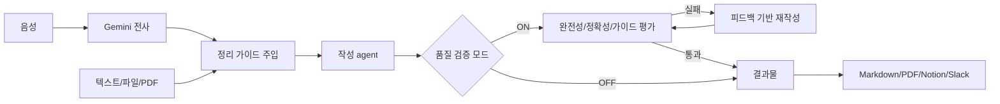

# 강의 자동 정리기

> 강의 녹음, 슬라이드, 텍스트를 넣으면 전사, 요약, 품질 검증, 재작성, PDF/Notion/Slack 출력까지 이어지는 Streamlit 기반 LLM 웹 애플리케이션입니다.

**라이브 데모:** <https://lecture-summarizerr.streamlit.app>

## 핵심 성과

| 영역 | 구현 내용 |
|---|---|
| 입력 | 텍스트 붙여넣기, `.txt`, `.md`, `.pdf`, 음성 파일 업로드 |
| 전사 | Gemini Files API로 강의 음성 자동 전사 |
| 요약 | 사용자가 수정 가능한 정리 가이드를 system instruction으로 주입 |
| 품질 검증 | 완전성, 정확성, 가이드 준수 3개 평가자를 병렬 실행 |
| 재작성 | 평가 실패 시 피드백 기반 자동 재작성, 최대 2회 |
| 출력 | Markdown, PDF, Notion 페이지, Slack 완료 알림 |
| 배포 | 로컬, Streamlit Cloud, Hugging Face Spaces, VPS Docker |

## 프로젝트 개요

강의 자료를 독학용 정리본으로 바꾸는 개인 학습 자동화 도구를 만들었습니다. 사용자는 클로바노트 텍스트, 강의 슬라이드 PDF, 직접 붙여넣은 텍스트, 음성 녹음 파일을 입력할 수 있습니다.

앱은 입력 자료를 하나의 lecture context로 합치고, 사용자가 정의한 정리 가이드를 바탕으로 Gemini가 Markdown 정리본을 생성합니다. 품질 검증 모드를 켜면 정리본을 바로 끝내지 않고, 3개의 평가자가 누락, 환각, 가이드 위반을 검사한 뒤 필요하면 재작성합니다.

최종 결과는 화면에서 확인하고 Markdown/PDF로 내려받을 수 있으며, 필요하면 Notion 페이지로 저장하고 Slack으로 완료 알림도 보낼 수 있습니다.

## 핵심 설계와 구현 포인트

### 1. 단순 요약이 아니라 품질 검증 루프로 설계

처음부터 목표는 "요약 한 번 생성"이 아니라, 실제 공부에 쓸 수 있는 self-study material을 만드는 것이었습니다. 그래서 결과물이 원문 내용을 빠뜨리거나, 없는 내용을 만들어내거나, 내가 정한 형식을 어기지 않도록 평가와 재작성 루프를 넣었습니다.

품질 검증 모드에서는 세 평가자를 병렬로 실행합니다.

| 평가자 | 검사 기준 |
|---|---|
| 완전성 | 강의 원문에서 중요한 개념, 예시, 수치가 빠지지 않았는가 |
| 정확성 | 원문에 없는 내용을 지어내지 않았는가 |
| 가이드 준수 | 정리 가이드의 형식과 톤을 지켰는가 |

평가 결과가 하나라도 실패하면 실패 사유를 모아 재작성 agent에게 넘기고, 최대 2회까지 개선합니다.

### 2. 나만의 정리 가이드를 앱 안에서 수정 가능하게 함

강의 정리는 단순히 짧게 요약하는 것보다, 내가 나중에 다시 공부할 수 있는 형식이 중요했습니다. 그래서 앱에 기본 정리 가이드를 넣어두고, 실행할 때마다 사이드바에서 수정할 수 있게 했습니다.

가이드에는 독학 자료의 목표, 개념 설명 방식, 직관 단락, 표와 수식 설명, 파일명 규칙까지 들어 있습니다. 즉, LLM을 매번 새로 설득하는 대신 내 정리 기준을 재사용 가능한 prompt asset으로 만든 것입니다.

### 3. 입력 형식을 넓혀 실제 사용 흐름에 맞춤

강의 자료는 한 가지 형식으로만 오지 않습니다. 어떤 날은 클로바노트 텍스트가 있고, 어떤 날은 슬라이드 PDF만 있고, 어떤 날은 녹음 파일만 남습니다. 그래서 입력을 다음처럼 나눠 받도록 만들었습니다.

- `.txt`, `.md`: 텍스트 그대로 읽기
- `.pdf`: `pypdf`로 페이지 텍스트 추출
- 음성 파일: Gemini Files API로 전사
- 직접 붙여넣기: 클로바노트나 메모를 바로 입력

파일명도 함께 context에 넣어, 여러 자료를 동시에 올렸을 때 출처가 섞이지 않도록 했습니다.

### 4. 출력까지 공부 흐름에 맞게 연결

정리본은 앱 화면에서 보는 것만으로는 부족했습니다. 그래서 결과물을 Markdown으로 다운로드하고, Chrome headless 기반 PDF로 변환하며, 필요하면 Notion에 저장하고 Slack으로 완료 알림을 보내도록 연결했습니다.

특히 PDF는 수식 렌더링이 중요해서 `template.html`과 MathJax를 사용하고, `md2pdf_nonode.py`에서 Chrome/Edge를 탐지해 변환하도록 구성했습니다. Node가 없는 Windows 환경에서도 쓸 수 있게 Python 변환 경로를 둔 점도 실제 사용성을 고려한 부분입니다.

## 동작 구조



## 주요 기능

| 기능 | 설명 |
|---|---|
| 강의 자료 업로드 | `.txt`, `.md`, `.pdf` 여러 개를 동시에 입력 |
| 음성 전사 | `mp3`, `wav`, `m4a`, `ogg`, `flac`, `aac` 등 전사 |
| 가이드 기반 정리 | 기본 정리 가이드를 system instruction으로 사용 |
| 품질 검증 루프 | 3개 평가자 병렬 실행 후 실패 시 자동 재작성 |
| PDF 변환 | Markdown을 HTML template로 변환 후 Chrome headless로 PDF 생성 |
| Notion 저장 | Markdown을 Notion block으로 변환해 페이지 생성 |
| Slack 알림 | 정리 완료 시 제목과 요약 일부, Notion 링크 전송 |

## 기술 스택

| 영역 | 사용 |
|---|---|
| App | Streamlit |
| LLM | Google Gemini (`google-genai`, `gemini-2.5-flash`) |
| 음성 전사 | Gemini Files API |
| PDF 입력 | `pypdf` |
| PDF 출력 | `markdown`, `template.html`, Chrome headless, MathJax |
| Notion | `notion-client` |
| Slack | Incoming Webhook, Python standard library |
| 배포 | Docker, Streamlit Cloud, Hugging Face Spaces, VPS |

## 빠른 시작

```bash
pip install -r requirements.txt
streamlit run app.py
```

Windows에서는 `run.bat`을 실행해도 됩니다.

Gemini API 키는 앱 사이드바에 입력하거나 `.env`에 둘 수 있습니다.

```env
GEMINI_API_KEY=your_key_here
NOTION_TOKEN=optional
NOTION_PARENT_PAGE_ID=optional
SLACK_WEBHOOK=optional
```

PDF 출력을 사용하려면 Chrome 또는 Chromium 기반 브라우저가 필요합니다.

`.env`에는 실제 API 키가 들어가므로 커밋하지 않습니다. 저장소에는 `.gitignore`로 `.env`, 캐시, 임시 출력물을 제외하도록 설정했습니다.

## 배포

| 방식 | PDF | 특징 |
|---|---|---|
| 로컬 실행 | 가능 | 개인 사용에 가장 간단 |
| Streamlit Community Cloud | 제한적 | 데모 배포가 쉬움 |
| Hugging Face Spaces Docker | 가능 | Dockerfile로 Chrome 포함 가능 |
| VPS Docker | 가능 | 항상 켜두는 개인 서비스로 운영 가능 |

VPS 또는 Docker 환경에서는 다음처럼 실행할 수 있습니다.

```bash
docker build -t lecture-summarizer .
docker run -p 7860:7860 lecture-summarizer
```

## 프로젝트 구조

```text
.
├── app.py              # Streamlit UI, Gemini 호출, 품질 검증 루프, 출력 연결
├── md2pdf_nonode.py    # Markdown -> PDF 변환
├── template.html       # PDF 스타일과 MathJax 렌더링
├── Dockerfile          # Docker 배포 설정
├── requirements.txt    # Python 의존성
├── .gitignore          # API 키, 캐시, 임시 출력물 제외
├── run.bat             # Windows 로컬 실행
├── run_exe.py          # exe 패키징 진입점
└── README.txt          # 보조 설명 파일
```

## 한계와 개선 방향

- Streamlit Community Cloud에서는 Chrome 기반 PDF 생성이 제한될 수 있어, PDF까지 안정적으로 쓰려면 Docker 환경이 더 적합합니다.
- 품질 검증 루프는 정확도를 높이는 대신 LLM 호출 횟수와 시간이 늘어납니다. 빠른 초안이 필요할 때는 품질 검증 모드를 끌 수 있게 했습니다.
- Notion 변환은 제목, 불릿, 콜아웃, 기본 텍스트 중심으로 처리합니다. 복잡한 표나 수식 블록은 추가 변환 로직을 보강할 수 있습니다.
- 현재는 단일 앱 파일 중심 구조입니다. 기능이 더 커지면 `src/` 모듈 분리와 테스트 코드 추가가 다음 개선 방향입니다.
